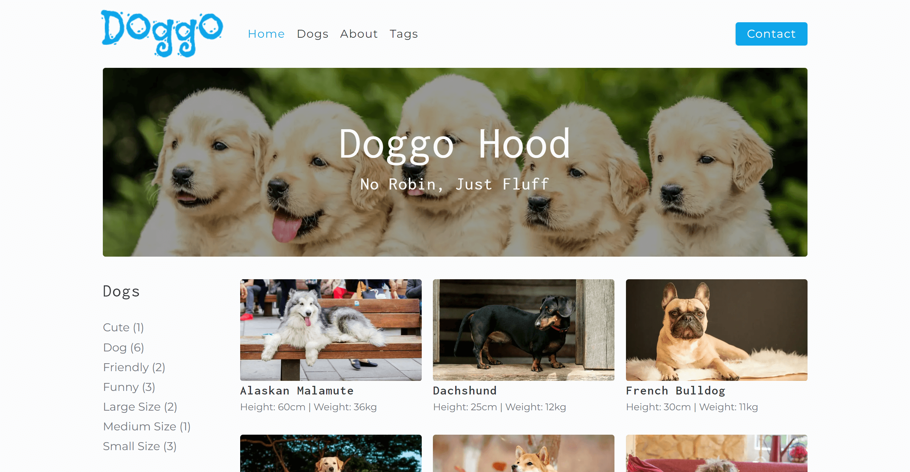
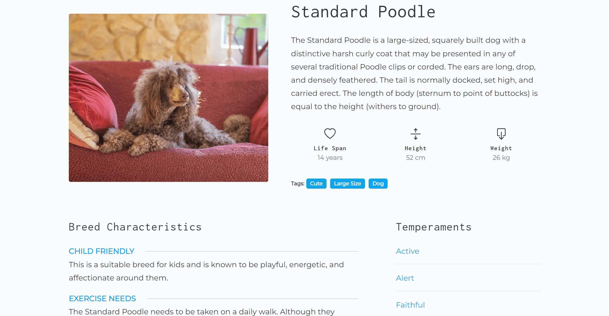
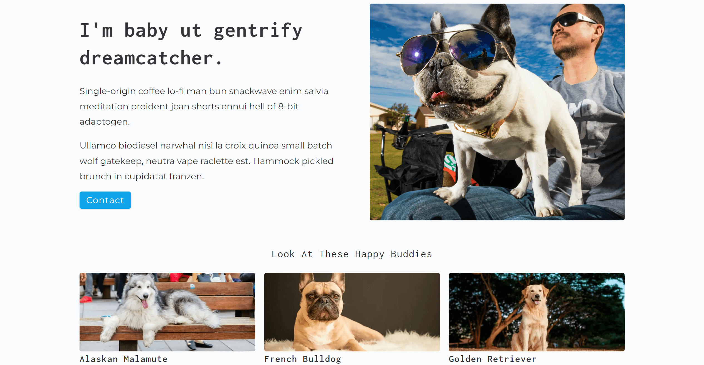
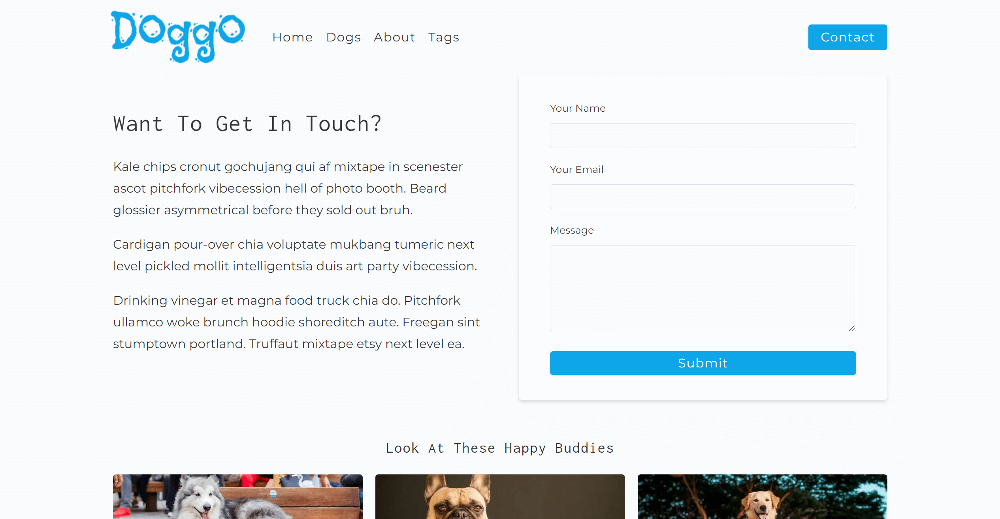
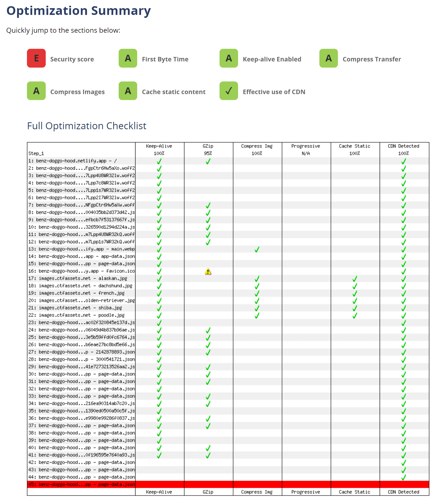

# Doggo Hood

A website that contain information about dog breeds.

[View Live Site](https://benz-doggo-hood.netlify.app/)

- Built with Gatsby as a SSG so it's blazing fast
- You can filter breeds by tags and also view specific details about a breed
- All dog breeds information were gather from [Dog Breeds List](https://www.dogbreedslist.info/)

## Preview

&nbsp;
&nbsp;

## Tech stack

- [Gatsby](https://www.gatsbyjs.com/)
- [React](https://reactjs.org/)
- [GraphQL](https://graphql.org/)
- [Contentful](https://www.contentful.com/) Headless CMS

## Performance Optimization

- Performance score is 99 in both mobile and desktop version according to [PageSpeed Insights](https://pagespeed.web.dev/report?url=https%3A%2F%2Fbenz-doggo-hood.netlify.app%2F&form_factor=mobile)
- Images are optimized using [gatsby-plugin-image](https://www.gatsbyjs.com/plugins/gatsby-plugin-image)
- Fonts are preloaded by [gatsby-plugin-webfonts](https://www.gatsbyjs.com/plugins/gatsby-plugin-webfonts/) to improve website performance
- SEO enhancement using [gatsby-plugin-react-helmet](https://www.gatsbyjs.com/plugins/gatsby-plugin-react-helmet/)

## Show your support

Give a ⭐️ if you like this project!

## License

[MIT](LICENSE)
